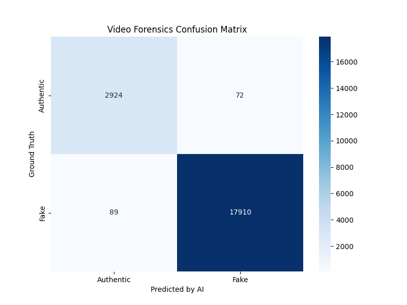

# 📽️ Digital Video Forensics Project

A high-performance **Video Tampering Detection System** using Deep Learning to identify spatial and temporal manipulations in digital video content.

## 🧬 Detection Strategy
A **Dual-Stream Forensic Architecture**:
1. **CNN (Spatial Layer)**: Analyzes individual frame textures, noise patterns, and artifacts using ResNet backbone to detect splicing and copy-move.
2. **LSTM (Temporal Layer)**: Evaluates sequences of frames to identify temporal inconsistencies like frame deletion, insertion, or re-ordering.

---

## 📁 Project Structure
- `data/`: Raw original and tampered videos (e.g., from Kaggle).
- `processed/`: Extracted and normalized frames ready for training.
- `models/`: Neural network architecture scripts.
- `checkpoints/`: Saved model weights during training.
- `scripts/`: Utilities for preprocessing, training, and evaluation.
- `results/`: Performance metrics (Accuracy, F1-Score) and visualization plots.

## 🚀 Step-by-Step Forensic Workflow

Follow these steps to reproduce the training and evaluation process:

### 1️⃣ Environment Setup
Install the required libraries:
```bash
pip install -r requirements.txt
```
Verify GPU acceleration:
```bash
python check_env.py
```

### 2️⃣ Data Acquisition
Download the FaceForensics++ (C23) dataset:
```bash
python scripts/download_data.py
```

### 3️⃣ Frame Processing
Extract frames from videos and generate labels for the AI:
```bash
python scripts/extract_frames.py
```

### 4️⃣ Model Training
Train the Dual-Stream model on your local/cloud GPU:
```bash
python scripts/train_model.py
```
*Note: This generates `results/training_history.csv`.*

### 5️⃣ Forensic Evaluation
Run the evaluation suite to measure performance:
```bash
python scripts/evaluate_model.py
```

### 6️⃣ Live Prediction (Test on Random Video)
Test the model on any video file:
```bash
python scripts/predict_video.py --video_path path/to/video.mp4
```

---

## 📊 Project Final Run Results

Below are the findings from our latest forensic analysis.

### 📈 Confusion Matrix
The following heatmap illustrates the model's performance in distinguishing between **Authentic** and **Tampered (Fake)** videos:



### 📉 Training History
You can view the full training loss progression over epochs here:


### 📑 Summary Report
Detailed metrics (Accuracy, Precision, Recall) can be found in the .

---
*Developed for Digital Video Forensics *
